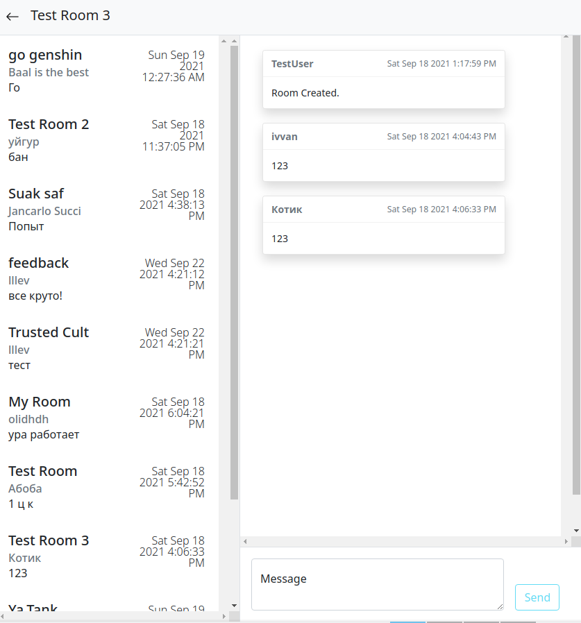
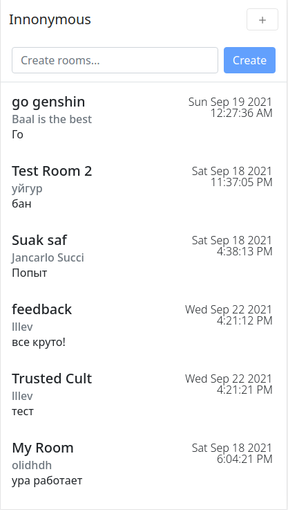
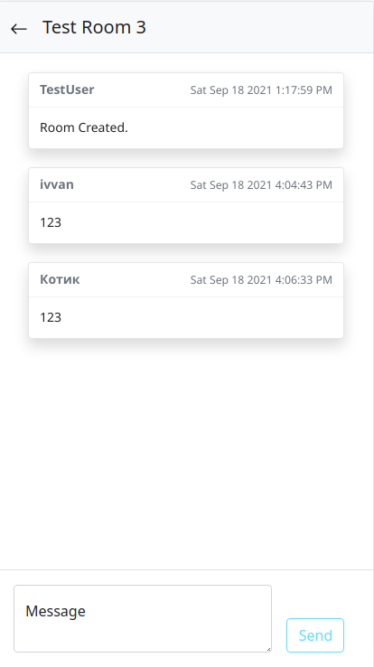

# [Innonymous](https://innonymous.tk/)

 Innonymous is open-source light-weight super-fast and anonymous chat. Backend in [python fast-api](https://fastapi.tiangolo.com/), client-side in ReastJS, using web-sockets.Persistant storages are postgres and rabbitmq. Backend has anti spam registration using auto-generated CAPCHA.

<br>


Since we have clear and easy [documentation](https://innonymous.tk/api/docs) you can use our backend and create your own client-side application! 

<br>

## Source code

You may notice that this repo does not have any source code. We decided to split backend, frontend and main repo. Here you can find all links:

+ API Server - https://github.com/innonymous/api-server
+ Web Client - https://github.com/innonymous/web-client
+ Compose (this repo) - https://github.com/innonymous/compose

## Screenshots

<p align="center">

</p>
<p align="center">



</p>


## Quick start

1. Make sure you have [docker-compose](https://docs.docker.com/compose/install/) on your machine.

2. Configure `.env` file:
```sh
$ cp .env.example .env
```
|env variable|description|example|
|--|--|--|
|AMQP_PASSWORD| RabbitMQ in docker container will use it, so this password only for infrastructure usage. However you should keep it in secret. |mycoolpassword1|
|DATABASE_PASSWORD| Infra password for postgres |mycoolpassword2|
|API_KEY| 32-bytes infra token for backend JWT generation |12345678901234567890123456789012|


3. Now start the whole project. You can add `-d` flag to run in daemon mode:

```sh
docker-compose up
```

<hr>
<br>

<center> 

*You can say and write whatever you think, but you should think carefully* 

</center>