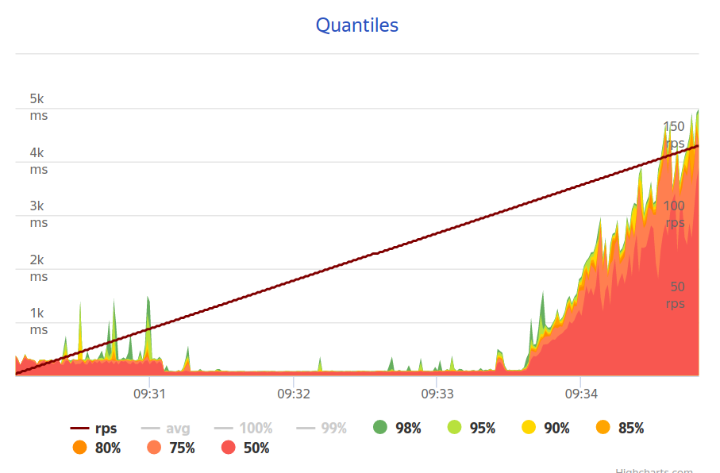
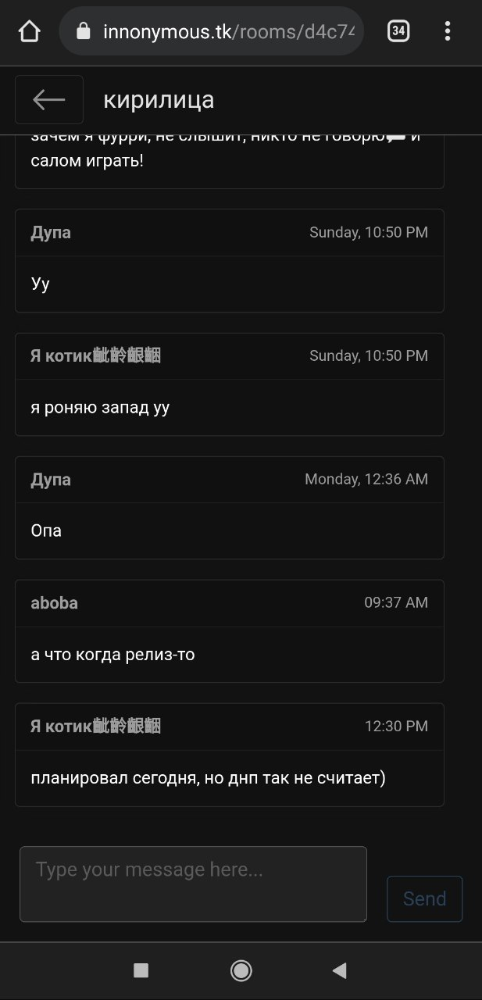
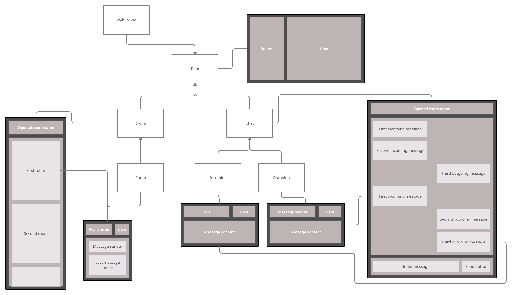
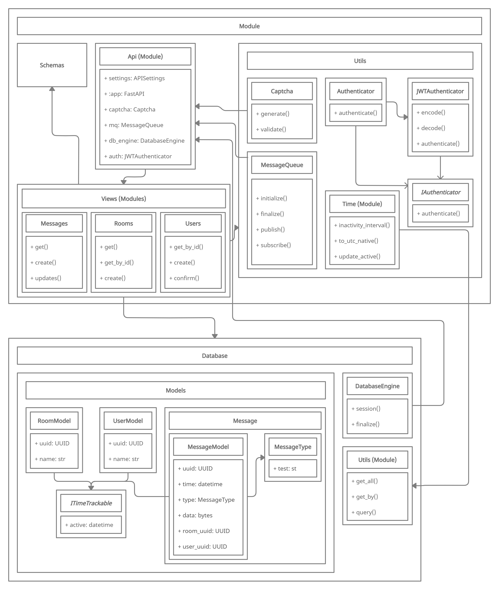

# [Innonymous](https://innonymous.tk/)

 Innonymous is mobile-ready open-source light-weight and anonymous chat. Backend in [python FastAPI](https://fastapi.tiangolo.com/), client-side in [ReastJS](https://reactjs.org/), using web-sockets. Persistant storages are postgres and rabbitmq. Backend has anti spam registration using auto-generated CAPTCHA.

<br>


Since we have clear and easy [documentation](https://innonymous.tk/api/docs) (powered by swagger) you can use our backend and create your own client-side application! 

<br>

## Source code

You may notice that this repo does not have any source code. We decided to split backend, frontend and main repo. Here you can find all links:

+ API Server - https://github.com/innonymous/api-server
+ Web Client - https://github.com/innonymous/web-client
+ Compose (this repo) - https://github.com/innonymous/compose


## Metrics

Our backend [passed](https://overload.yandex.net/460788#tab=test_data&tags=&plot_groups=main&machines=&metrics=&slider_start=1631255404&slider_end=1631255689&compress_ratio=1) the load test of 100-150 `RPS` (requests per second). Tests were done using Yandex.Overload **on one core**.

Here you can see a plot of the testing results. Backend can easy handle 100 `RPS`, then `response time` starts increasing.

<p align="center">

</p>

Our system is scalable, so it is possbile to create several backend instances and increase `RPS` even more!

## Screenshots

Desktop version:
<p align="center">

</p>

Mobile version:
<p align="center">

</p>


## Architecture brief view

### [Client side](https://github.com/innonymous/web-client)

Below you can find UML/Design diagram of React containers and web UI boxes:


<p align="center">

</p>

### [Server side](https://github.com/innonymous/api-server)

Server backend is very easy, understandable and fast:

<p align="center">

</p>


## Quick start

We alreay pushed Innonymous to production: https://innonymous.tk/


However you can start your own version of Innonymous! It is as easy as 1-2-3:

1. [Install Docker and Docker Compose](https://docs.docker.com/get-docker/) if you don't have it already
    * On Mac and Windows, Docker comes with Docker Compose
    * On Linux you need to install Docker Engine and Docker Compose separately

2. Configure `.env` file:
```sh
$ cp .env.example .env
```
|env variable|description|example|
|--|--|--|
|AMQP_PASSWORD| RabbitMQ in docker container will use it, so this password only for infrastructure usage. However you should keep it in secret. |mycoolpassword1|
|DATABASE_PASSWORD| Infra password for postgres |mycoolpassword2|
|API_KEY| 32 bytes in hex, can be generated as `openssl rand -hex 32` for backend JWT generation |12345678901234567890123456789012|


3. Now start the whole project. You can add `-d` flag to run in daemon mode:

```sh
docker-compose up
```

Done! Now go to `localhost:8000` and test your chat!

<hr>
<br>

<center> 

*You can say and write whatever you think, but you should think carefully* 

</center>