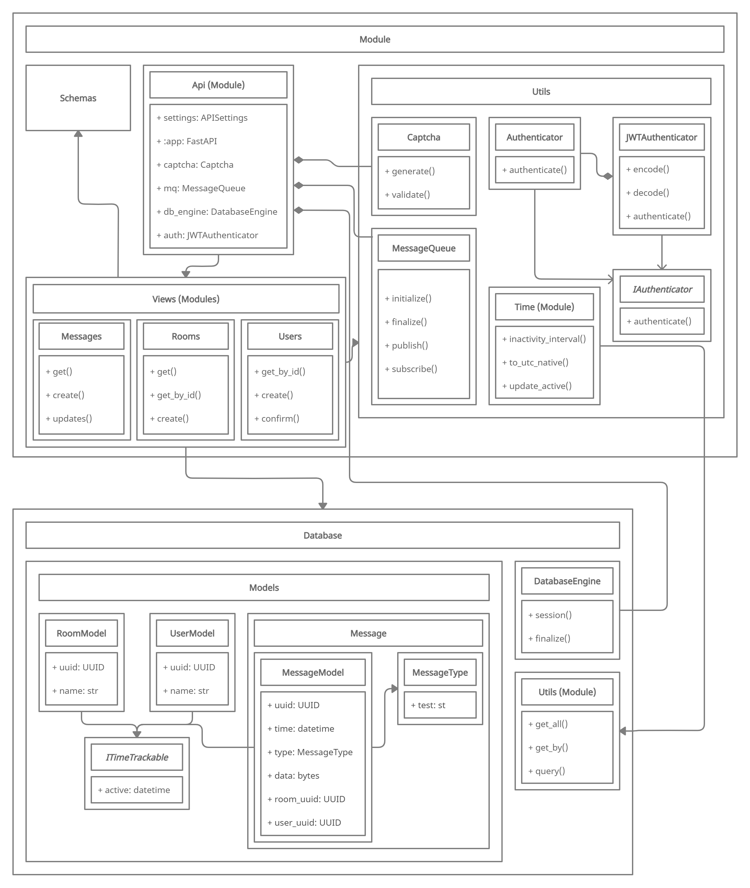
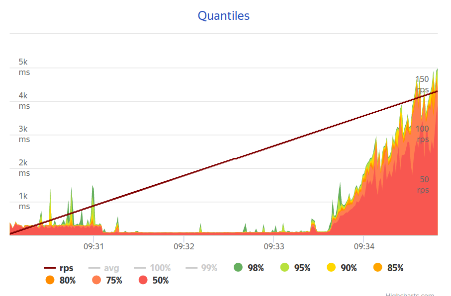

Architecture
===

## Architecture of [server-side](https://github.com/innonymous/api-server)

Server backend is very easy and understandable (UML diagram):

## Metrics

Since we made good decisions in the backend architecture and used new technologies, our backend [passed](https://overload.yandex.net/460788#tab=test_data&tags=&plot_groups=main&machines=&metrics=&slider_start=1631255404&slider_end=1631255689&compress_ratio=1) the load test of 100-150 `RPS` (requests per second). Tests were done using Yandex.Overload **on one core**.

Here you can see a plot of the testing results. Backend can easy handle 100 `RPS`, then `response time` starts increasing.

## Scalability

Our system is scalable, so it is possible to create several backend instances and increase `RPS` even more!
