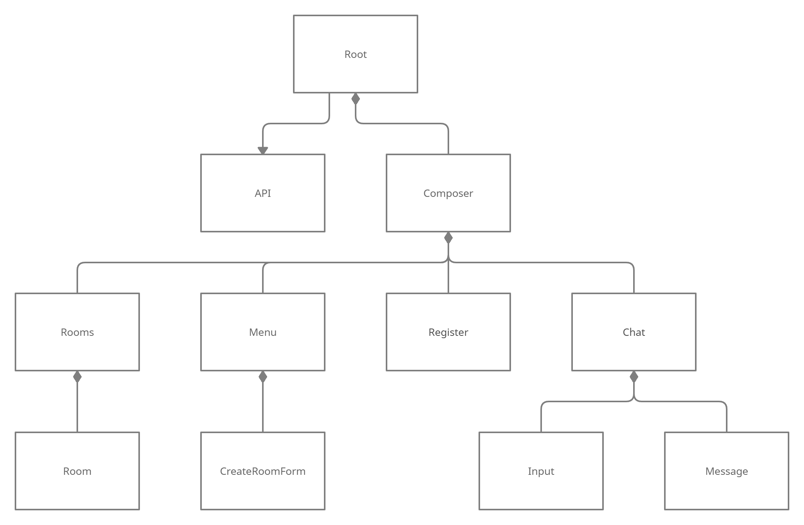

Design
===

## [Сlient-side](https://github.com/innonymous/web-client)

Below you can find design of React containers. 

Arrows means communication. Arrows with diamonds means that one container has and controls the other.

## SOLID and Design patterns

We try to use the good development patterns. Here is a list of those that we use most often in this project:

+ **Single-responsibility principle**: we distribute the work between modules, such that every file (module) does signle job.

+ **Depend upon abstractions**: We use abstraction a lot: Database module does not depends on Postgres only, Queue module does not depends on RabbitMQ only, Authenticator class can work not only with JWT, Captcha module can generate captcha in different way. The only thing you have to do is rewrite logic of module, leaving interface the same.

+ **Dependency injection**: Fast-API provides builtin dependency injection pattern, getting objects using `fastapi.Depends` function: [example here](https://github.com/innonymous/api-server/blob/424ff581c2de6b069eda65aed0d6f671b2b31ab3/innonymous/api/views/rooms.py#L69)

+ **Interface segregation principle**: We have different interfaces for getting, creating, rooms/users.
